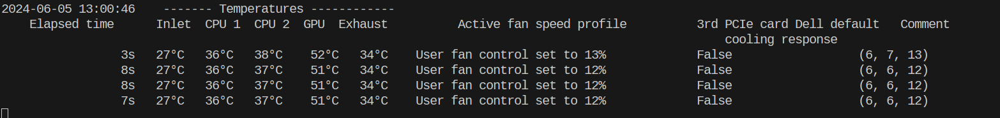

<div id="top"></div>


# WARNING
This was implmented for personal use and not ready to be deployed, it has barely been tested and has some parameters that i find useful
Please don't use unless you know what you are doing. There is no support etc

This version is modified to run as a python script. There is a helper script to check the GPU temps and adjust fan speeds accordingly.

# Dell iDRAC fan controller Docker image
Download Docker image from :
- [GitHub Containers Repository](docker pull ghcr.io/rcastberg/dell_idrac_fan_controller_with_line_interpolation:latest)

<!-- TABLE OF CONTENTS -->
<details>
  <summary>Table of Contents</summary>
  <ol>
    <li><a href="#container-console-log-example">Container console log example</a></li>
    <li><a href="#usage">Usage</a></li>
    <li><a href="#parameters">Parameters</a></li>
    <li><a href="#troubleshooting">Troubleshooting</a></li>
    <li><a href="#contributing">Contributing</a></li>
  </ol>
</details>

## Container console log example



<p align="right">(<a href="#top">back to top</a>)</p>

<!-- PREREQUISITES -->
## Prerequisites
### iDRAC version

This Docker container only works on Dell PowerEdge servers that support IPMI commands, i.e. < iDRAC 9 firmware 3.30.30.30.

### To access iDRAC over LAN (not needed in "local" mode):
 NOT implemented

<!-- USAGE -->
## Usage

1. with LAN iDRAC:

```bash
docker run -d \
  --name Dell_iDRAC_fan_controller \
  --restart=unless-stopped \
  -e CHECK_INTERVAL=5 \
  -e IDRAC_USERNAME=root \
  -e IDRAC_PASSWORD=Passw0rd \
  -e IDRAC_HOST=10.0.10.13 \
  -e GPU_HOST=10.0.0.12 \
  -e GPU_PORT=980 \
  -e MIN_FAN=15 \
  -e CPU_CURVE="pow(10,((temp-10)/20))" \
  -e GPU_CURVE="pow(10,((temp-18)/20))" \
  ghcr.io/rcastberg/dell_idrac_fan_controller_docker_python:latest
```

1. to use with LAN iDRAC:

```yml
version: '3'

services:
  Dell_iDRAC_fan_controller:
    image: ghcr.io/rcastberg/dell_idrac_fan_controller_docker_python:latest
    container_name: Dell_iDRAC_fan_controller
    restart: unless-stopped
    environment:
      - GPU_HOST=10.0.10.12
      - GPU_PORT=980
      - IDRAC_USERNAME=root
      - IDRAC_PASSWORD=Passw0rd
      - IDRAC_HOST=10.0.10.13
      - CHECK_INTERVAL=5
      - THIRD_PARTY_PCIE_COOLING=False
      - MIN_FAN=10
      - CPU_Curve="pow(10,((temp-10)/20))"
      - GPU_Curve="pow(10,((temp-18)/20))"
      - DELL_Control=75
```

<p align="right">(<a href="#top">back to top</a>)</p>

<!-- PARAMETERS -->
## Parameters

All parameters are optional as they have default values (including default iDRAC username and password).

- `IDRAC_HOST` iDRAC's IP address. **Default** value is "localhost".
- `IDRAC_USERNAME` parameter is only necessary if you're adressing a distant iDRAC. **Default** value is "root".
- `IDRAC_PASSWORD` parameter is only necessary if you're adressing a distant iDRAC. **Default** value is "password".
- `GPU_HOST` parameter specifiying the default GPU host, **Default** value is the same as IDRAC_HOST
- `GPU_PORT` parameter specifying the dfeualt GPU port **Default** value is 980
- `CHECK_INTERVAL` parameter specifying the default check interval **Default** value is 5s, i am unable to get much lower than this.
- `THIRD_PARTY_PCIE_COOLING` parameter is a boolean that allows to disable third-party PCIe card Dell default cooling response. Default value is false.
- `MIN_FAN`paraneter specifying the minimum fan speed, **Default** is 10%
- `CPU_Curve` sting representation of curve in python, temp is replaced with sensor value, **Default** is "pow(10,((temp-10)/20))", see [Reddit article](https://www.reddit.com/r/homelab/comments/x5y63n/fan_curve_for_dell_r730r730xd/) for more information, default is quite conservative. 
- `GPU_Curve` string representation of curve in python, temp is replace with GPU sensor value **Default** "pow(10,((temp-18)/20))", as abvove for CPU_Curve.
- `DELL_Control` parameter with percentage to hand over control to the dell alogrithumn, **Default** 75C
- `HYSTERISIS_LENGTH` parameter of number of loops to keep a hysteriss, so that we keep the system cool for an extended period. **Default** 20 loops

<p align="right">(<a href="#top">back to top</a>)</p>

<!-- TROUBLESHOOTING -->
## Troubleshooting
Will add later if nessacary
<p align="right">(<a href="#top">back to top</a>)</p>

<!-- TODO -->
## ToDo:
1. Add support for MultiGPU
2. Clean up code

<!-- CONTRIBUTING -->
## Contributing

Contributions are what make the open source community such an amazing place to learn, inspire, and create. Any contributions you make are **greatly appreciated**.

If you have a suggestion that would make this better, please fork the repo and create a pull request. You can also simply open an issue with the tag "enhancement".
Don't forget to give the project a star! Thanks again!

1. Fork the Project
2. Create your Feature Branch (`git checkout -b feature/AmazingFeature`)
3. Commit your Changes (`git commit -m 'Add some AmazingFeature'`)
4. Push to the Branch (`git push origin feature/AmazingFeature`)
5. Open a Pull Request

<p align="right">(<a href="#top">back to top</a>)</p>
